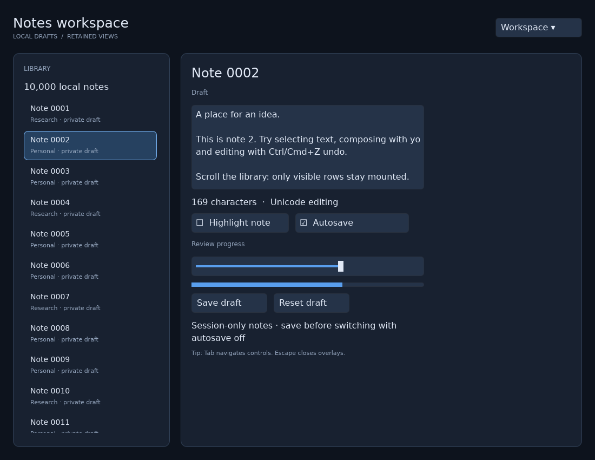

# Building a desktop application

Linux and macOS are the first target platforms. `zgui` contains retained state, layout, input, editing, semantics, and widgets; `zgui-gpu` supplies wgpu rendering and shaped text; `zgui-desktop` hosts native windows, IME, clipboard, and accessibility. Linux native smoke tests run in this repository's development environment. A Linux build does not prove macOS runtime behavior: run the same examples and platform CI on macOS before shipping there.

Dynamic window title, size, visibility and window-manager requests are documented in [native window controls](window-controls.md).

For application code, start with [components, children, providers and slots](composition.md) and [fluent styling](styling.md). `WindowContext::render(view)` mounts a declarative tree and supplies component-owned tasks. The lower-level `Ui` methods documented below remain available for custom controls and renderer integration.

Run the component example, widget gallery or notes workspace:

```sh
cargo run -p zgui-desktop --example components
cargo run -p zgui-desktop --example gallery
cargo run -p zgui-desktop --example workbench
```



The workbench has a 10,000-row virtual library, a selection-driven detail form, Unicode text editing, session-only draft storage, an autosave toggle, sliders, a keyboard-navigable menu, and a confirmation dialog. Autosave writes visited drafts into an in-memory map; it does not write files. Closing the application discards that map. The shell and library viewport respond to window size; the detail editor has a fixed readable width and the workspace requires about 820 logical pixels horizontally to show its complete form.

## A window and reactive widgets

```rust,no_run
use zgui::compose::prelude::*;
use zgui_desktop::{Application, WindowOptions};

fn greeting() -> View {
    component(|cx| {
        let name = cx.state(String::from("Hello"));
        let displayed = name.clone();
        column().w_full().h_full().p(24.0).gap(12.0)
            .child(text_input("Name", name).w(360.0).h(40.0))
            .child(text_signal(move || displayed.get()))
    })
}

fn main() -> Result<(), Box<dyn std::error::Error>> {
    Application::new()
        .window(WindowOptions {
            title: "My application".into(),
            width: 800.0,
            height: 600.0,
            ..Default::default()
        })
        .run(|cx| { cx.render(greeting()); })
}
```

The component constructor runs once for each mounted instance. Its state belongs
to that instance, and `text_signal` subscribes only to the values it reads.
Editing the input updates its bound signal and the retained label. Equal writes
do not schedule redundant updates. Reusable functions return `View`; containers
accept `.child(...)` or `.children(...)`. Resolve shared models with
`cx.service::<Model>()` and use `cx.slot(...)` for caller-owned content.

Fluent `.hover(...)`, `.focus(...)`, `.disabled(...)`, inherited typography and
`.reactive_style(...)` apply to these same retained views. See the
[styling guide](styling.md) for exact methods and inheritance rules. `Ui.theme`
remains a construction-time default for low-level widgets; it is not a live
cascading theme engine.

Custom controls can use `ui.bind(owner, callback)` and `ui.on_event(...)` for
retained behavior. Low-level event callbacks receive capture, target or bubble
phases; check the phase to avoid duplicate actions. Prefer activation events for
buttons so pointer and keyboard input share behavior.

## Layout and resizing

Rows and columns support fixed/intrinsic sizing, min/max constraints, margin insets, padding, gaps, flex grow/shrink, main-axis justification, and cross-axis alignment. Flex shrink defaults to zero to preserve explicitly sized content. Overlays retain back-to-front child order. Text wrapping is opt-in through `.text_wrap(true)`; the desktop host installs the same font system used by its renderer. `Transform` is translation-only.

Use `.w_full()`, `.h_full()`, flex styles and `.reactive_style(...)` for responsive component geometry. `WindowContext.viewport` supplies logical `(width, height)` when application policy depends on the window size. Low-level integrations can bind it to an owner and update retained styles or call `ScrollView::resize`. Release any `RefCell<Scene>` borrow before setting signals, because a signal can synchronously run code that borrows the scene. The host performs physical-pixel surface resizing and DPI conversion separately. `Scene::prepare_layout` makes geometry current for hit testing without discarding pending damage; `flush` is the renderer's frame-consumption boundary.

## Scrolling and virtual rows

Use `scroll(offset).children(...)` for ordinary retained content and
`virtual_list(...)` for a large fixed-height collection. `variable_virtual_list`
accepts application-supplied row heights; `measured_virtual_list` measures mounted
children and keeps offscreen heights as estimates. Each takes a stable key and a
row builder returning `View`. Fluent viewport dimensions, `.scrollbar(true)` and
`.keyboard_navigation(true)` keep scrolling behavior within the child/component
architecture. Rows retain their state while mounted; removing an offscreen row
disposes its owned subscriptions and tasks. See [virtual lists](composition.md)
for complete signatures, anchoring and cache costs.

The lower-level `ScrollView::mount(ui, parent, width, height)` returns a clipped viewport, a `content` node, and signals for offset, extent, and viewport size. Set its content height explicitly as data changes. Scroll offsets clamp when content or viewport dimensions change. Moving content changes a retained transform; it does not relayout every child. Nested wheel scrolling chains to a parent when the inner scroll view cannot move farther.

`VirtualListView::mount` takes a count, fixed row height, overscan, stable key function, and row initializer. It retains only visible rows plus overscan. Overlapping visible keys keep their node IDs and scopes; offscreen scopes are disposed. The initializer receives a `ViewScope`, so it can mount text, descendants, and subscriptions. `scope.retain(input.register(...))` ties an input binding to that row's lifetime. Store persistent edits and selection in a model keyed by item identity: an offscreen row deliberately does not keep a hidden widget alive. This low-level `VirtualListView` remains fixed-height; variable and naturally measured rows use the component APIs above.

## Menus and dialogs

Component applications can use `modal(label, open).children(...)` or
`popover(label, open, anchor).children(...)`. Styles describe the panel; portals
manage window placement, clipping escape, retained ownership, focus containment,
dismissal and automatic resizing/anchor tracking. Both are modal dialogs, including
the anchored popup. Escape/backdrop dismissal writes `false` to the supplied
signal. See the [component guide](composition.md) for lifecycle and nested/sibling
behavior. For action menus use `menu(label, open, anchor)` with `menu_item(label)` children;
activation closes the menu before callbacks, and keyboard navigation/overflow are
managed internally. Add `submenu(label, child_open).children(...)` for cascading
actions with owned triggers, side placement and Right/Left navigation. The imperative APIs below remain available for existing
low-level code.

Mount `Dialog` or `Popover` in a full-window `Layout::Overlay` layer. Populate the dialog's `body`, then call `show`. Open dialogs trap pointer and keyboard focus; `Escape` and optional backdrop activation dismiss them and restore the previous eligible focus. Nested dialogs belong beneath the active dialog root. Closing an outer dialog unwinds nested scopes and closes their state. Closed overlays remain retained but disabled until removed. Opening refreshes dialog sizing against the current viewport; bind `dialog.resize_to_viewport()` to the host viewport signal to recenter a dialog during live window resizing.

`Popover::item` creates menu items with Up/Down/Home/End navigation, disabled-item skipping, and dismissal before activation. `popover.show(&ui)` positions against its anchor and clamps to the current viewport. From a retained callback, use `show_with(&scene, &input)` instead of capturing the entire `Ui`. Position is refreshed on opening; continuous anchor-following while the menu remains open is not implemented.

## Ownership, tasks, and disposal

A mounted component owns its local state, bindings, child components and tasks
spawned with its `Context`. Conditional and keyed child regions retain matching
owners and dispose removed ones. `cx.slot(...)` captures the caller's lexical
providers while mounting the body under the receiver's lifetime. Applications
using this API do not need node IDs or explicit subtree removal.

For low-level integration, `Ui` owns widget bindings and subscriptions. Returned widget/component handles refer to that retained document; dropping a handle does not remove the widget. Call `Ui::remove(node)` to unmount a widget subtree and release its owned subscriptions, editor state, semantics, and input registrations. Do not directly remove `Ui`-owned nodes through `Scene` when you expect their owner metadata to be released immediately.

`ViewScope` provides a smaller RAII owner for template-generated or custom subtrees. It owns descendants, effects, inherited typed services, and resources retained with `retain`. Dropping it disposes resources and subscriptions before removing its scene root. `KeyedChildren` adds key validation, retained reorder, and keyed disposal. Duplicate input keys are rejected before mutation. Scopes share their scene through `Rc<RefCell<_>>`; do not keep a scene borrow across a scope drop, a signal write, or a user callback.

`cx.tasks.spawn(async move { ... })` schedules local futures and wakes the native loop when work becomes ready. `zgui::timer::sleep` is an awaitable timer; `yield_now` yields to another executor turn. Do not hold a reactive batch guard or scene borrow across `.await`. UI objects stay on the UI thread; use the host's thread-safe request interfaces and channels for background work instead of moving `Rc`-backed state between threads. Window tasks are dropped when that window closes. For native view-owned work, use `scope.retain(cx.tasks.spawn_scoped(async move { ... }))`. Its `ScopedTask` guard releases future captures when canceled, even before the host drains its pending queue, and wakes sleeping executor entries for cleanup. See [scoped native tasks](scoped-tasks.md) for a complete example. `ViewScope::spawn` and `LocalExecutor::spawn_scoped` remain available when you own the executor directly; their cancellation releases the future on its next ready turn. Plain `cx.tasks.spawn` is window-owned, so removing a widget does not cancel it.

## Animation frames

Animate from the window's frame clock rather than a timer. `cx.frames()` in a component (or `WindowContext::frames`) returns a `zgui::frame::FrameClock`; awaiting `frames.next()` resolves once per display refresh with a `Frame` whose `time` is the expected presentation time. Drive animations from that value, not `Instant::now()`, so they advance by whole refreshes even when the UI thread runs late. The host only ticks while a request is waiting, so an idle window does no work, and hidden, minimized or occluded windows pause until they are shown again.

```rust,ignore
let frames = cx.frames();
let angle = cx.state(0.0_f32);
let set = angle.clone();
cx.tasks().spawn(async move {
    let start = frames.next().await.time;
    loop {
        // A decorative spinner does not need every refresh of a 120 Hz display.
        let frame = frames.next().max_rate(30.).await;
        set.set((frame.time - start).as_secs_f32() * 3.);
    }
});
```

`max_rate(hz)` limits one request. Limited requests are spaced by whole refreshes (30 Hz on a 120 Hz display is every fourth refresh; a limit that does not divide the display rate rounds down, never exceeding it), and requests with the same effective rate tick together. `WindowOptions::max_frame_rate` and `WindowHandle::set_max_frame_rate` cap every animation in a window, for example to save power; input-driven redraws are not limited. On macOS the frames come from a `CADisplayLink` on the window's view, which follows the window across displays and lets ProMotion panels lower their rate when every waiting request accepts fewer frames. Wayland paces through compositor frame callbacks. X11 and other platforms tick on event-loop deadlines at the display's reported refresh rate (`DisplayInfo::refresh_rate_hz`, 60 Hz when unknown). A native source that stops ticking while frames are wanted is backed by the same timer after 250 ms. The [frame clock example](../crates/zgui-desktop/examples/frame_clock.rs) shows the cap and a limited request; `--smoke-test` measures the delivered rates.

## Background work and window lifecycle

`BackgroundPool::new(workers, queue_capacity)` creates an explicitly bounded worker pool. Its `spawn` method returns either a result future or `SpawnError::QueueFull`; it never grows an unbounded work queue. Await the future from a UI task, then update local signals. A panic in a job becomes `TaskError::Panicked`; a worker continues accepting work. Dropping a result skips queued work or discards a running result. Running closures cannot be forcibly interrupted. Dropping the last pool cancels queued jobs and lets running jobs finish without blocking the UI.

```rust,ignore
let pool = zgui::background::BackgroundPool::new(2, 16)?;
let job = pool.spawn(move || std::fs::read(path))?;
cx.tasks.spawn(async move {
    match job.await {
        Ok(Ok(bytes)) => status.set(format!("Loaded {} bytes", bytes.len())),
        Ok(Err(error)) => status.set(error.to_string()),
        Err(error) => status.set(error.to_string()),
    }
});
// Keep the pool in an application service while its queued work is needed.
```

Use `cx.windows.open(options, builder)` to create another independent window. Closing an opener does not close its child windows. The application exits when no windows or pending window requests remain. `WindowHandle` is thread-safe and targets exactly one window; requests after closure are inert.

`cx.on_close_requested(|| bool)` handles native close requests and `window.request_close()`: return false to keep the window open, for example while a save-confirmation dialog is shown. `window.close()` closes immediately and bypasses that policy. `cx.on_closed(|| ...)` runs once during window disposal. Asynchronous confirmation should reject the initial request and call `close` after the user completes it.

## Future templates

The proposed `service`, `provider`, `view`, `slot`, and event syntax remains a future compiler front end. The current Rust API does not imitate that syntax. A compiler can lower providers to `provide`/`provide_with`, state to `Context::state`, views to `component`, keyed loops to `keyed`, visible list windows to the component virtual-list constructors, and event actions to view handlers and component-owned tasks. Slots must retain lexical service/state captures while attaching their mounted subtree to the receiving view's ownership. See [architecture](architecture.md) for the concrete lowering table and retained cost model.

This is an evolving framework API. It does not claim a stable ABI, complete CSS layout, arbitrary affine transforms, or full rich-text editing. Hardware-backed performance and macOS behavior require platform-specific validation in addition to the repository's unit and Linux smoke tests.
