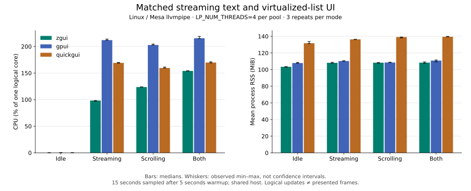

# GPUI capability expansion: matched performance comparison

All **36 trials passed** the unchanged delivered-work gate, with **59.6–59.95
logical updates per requested second** in every active trial. The audit recomputed
**10,808 samples** and verified **315 archived source files**. Source and executable
hashes identify the freshly built zgui release and the unchanged pinned GPUI 0.2.2
and QuickGUI reference adapters. No failed trials were dropped from this series.

zgui had lower observed active CPU medians and lower RSS medians in each mode in this condition. Idle CPU tied QuickGUI at the sampler’s zero-tick resolution.
Active CPU medians were 28.5–53.6% below GPUI and 9.3–41.9% below QuickGUI, depending
on the mode. **Scrolling RSS was nearly tied with GPUI**: 108.258 versus 108.531 MiB,
with overlapping observed ranges. These observations do not prove universal
superiority or minimum possible CPU/memory use.

Each cell is the median of three repeats followed by observed minimum–maximum.
CPU is percent of one logical core (100% = one core); RSS is MiB (2^20 bytes).
Peak RSS is the largest sampled value within each trial's measured window.
Idle zeros mean no CPU-tick increase at the sampler's resolution. Full precision
is retained in [summary.json](summary.json) and [current.csv](current.csv).

| Mode | Framework | CPU % median [min–max] | Mean RSS MiB median [min–max] | Peak RSS MiB median [min–max] |
|---|---|---:|---:|---:|
| idle | zgui | 0.000 [0.000–0.000] | 103.352 [102.820–103.647] | 103.352 [102.820–103.672] |
| idle | gpui | 0.133 [0.133–0.133] | 107.910 [107.645–108.676] | 107.910 [107.645–108.676] |
| idle | quickgui | 0.000 [0.000–0.066] | 131.730 [131.250–133.828] | 131.730 [131.250–133.828] |
| stream | zgui | 98.296 [97.028–98.375] | 108.164 [107.738–108.729] | 108.164 [107.738–108.730] |
| stream | gpui | 212.011 [211.635–214.001] | 110.290 [110.069–110.636] | 110.758 [110.617–110.914] |
| stream | quickgui | 169.160 [168.776–169.774] | 136.315 [136.212–136.370] | 136.352 [136.281–136.418] |
| scroll | zgui | 123.666 [123.574–124.109] | 108.258 [107.715–108.424] | 108.258 [107.715–108.512] |
| scroll | gpui | 202.758 [202.664–204.577] | 108.531 [108.379–108.867] | 108.531 [108.379–108.867] |
| scroll | quickgui | 159.521 [159.471–161.357] | 139.116 [138.017–139.180] | 139.168 [138.023–139.215] |
| both | zgui | 154.047 [153.781–154.389] | 108.395 [107.572–109.324] | 108.398 [107.750–109.324] |
| both | gpui | 215.457 [214.861–219.004] | 110.835 [109.171–111.548] | 110.859 [109.750–111.551] |
| both | quickgui | 169.801 [169.140–171.251] | 139.410 [139.379–139.915] | 140.617 [140.617–141.207] |

## What was measured

The shared deterministic workload renders the same controls, streaming text and
100,000 fixed-height virtual rows through each framework's public UI API.
The common seeded 180-tick captures were inspected before measurement:
[zgui](zgui.png), [GPUI](gpui.png), [QuickGUI](quickgui.png). Content, geometry,
font choice and line pitch match; rasterizer glyph pixels are not identical.
Virtualization mounts only viewport rows and overscan. Measured-height lists,
rich-text editing, video and the new advanced galleries are not exercised by
this workload; their functional checks are separate.

The preregistered [protocol](protocol.md) uses three rotated repeats of four
modes, 20 requested seconds each, excluding the first 5 seconds. Actual process
lifetimes were 20.094921–20.213432 seconds; sampled windows were 14.982461–15.134473 seconds.
The update gate uses requested duration and model ticks. It does not measure
presentation cadence, latency or energy.

All processes receive `LP_NUM_THREADS=4`; this controls each relevant Mesa worker
pool, **not total process threads**. Captured zgui and GPUI processes each had
four llvmpipe workers; QuickGUI had two pools, eight llvmpipe workers total.
The pinned QuickGUI backend also initializes EGL. No adapter was altered to
hide that initialization cost. This is an equal environment setting, not equal
backend initialization or total worker count.

The test used private Xvfb/Openbox, Mesa software Vulkan and the recorded private
Vulkan loader. [Host observations](host-observations.jsonl) found no concurrent
cargo/rustc/rust-lld processes, but substantial unrelated git/gh/zeron activity
was present. The shared machine was not CPU-pinned or thermally isolated.
Lifetime-averaged `ps` CPU values in that diagnostic log are distinct from the
benchmark's interval CPU calculations. Three repeats provide observed spread,
not confidence intervals. RSS includes shared/mapped resident pages and excludes
separate GPU memory and other processes. **These are not hardware-GPU or macOS
rankings.**

## Evidence and reproduction

- [Raw CSV](current.csv), per-trial `current.csv.FRAMEWORK.MODE.REPEAT.json` samples
  and logs, [metadata](current.csv.metadata.json), [audit](audit.json), and
  [independent audit](independent-audit.json).
- [Current framework build proof](zgui-build-manifest.json),
  [reference build proof](reference-build-manifest.json),
  [source hashes](source.json), [frozen source archive](source.tar.gz),
  [binary/environment preflight](preflight.json).
- [Build helper](build-orchestration.py), [runner](run.py),
  [seeded capture](capture.py), [post-measurement plot generator](plot.py).
  The plot generator was added after timing and is not a measured-source input.

Reproduction requires restoring the archived build inputs, including their
README version, and using a fresh output directory. The helpers refuse to replace
an existing measurement. Current documentation may change after the recorded
source-equality audit; that does not alter the archived source or executables.

The [previous four-worker series](../measured-framework-workers4/README.md)
predates the parity expansion. Its measurements remain separate and are not
pooled with this series or treated as a controlled causal ablation. The new
feature, ownership and native validation evidence is in the
[integrated validation packet](../../platform-validation/gpui-parity-integration/README.md).
